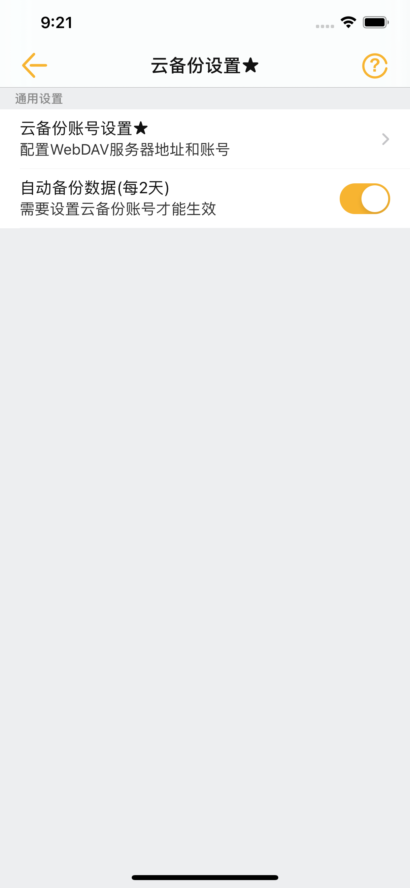
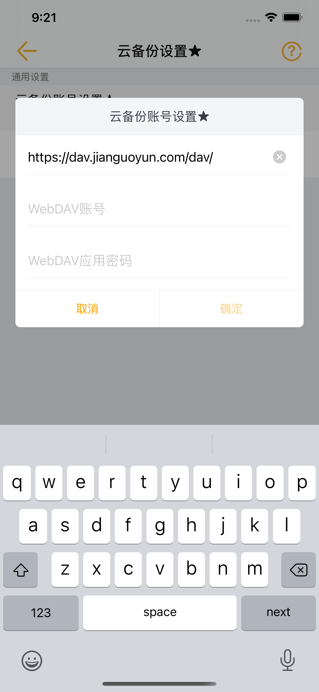
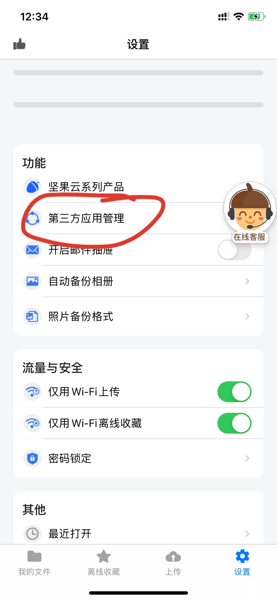

# 数据备份

## 1. 为什么要备份？

防止卸载便签无法找回数据；  
防止手机丢失无法找回数据；

## 2. 备份到哪里？

目前小周便签采用开放式WebDAV协议备份，您可以自己搭建备份服务器，也可以使用国内比较有名的**坚果云**来实现云备份。

## 3. 如何使用坚果云实现云备份？

如下图，只需要配置如下信息：

那么如何拿到这些信息呢？

1. 去App Store下载【坚果云】客户端；  
2. 注册并登录坚果云；  
3. 找到坚果云的设置里的第三方应用管理；  
4. 添加一个第三方应用，复制账号和应用密码到便签，确定即可；  
5. 注意密码一定要用第三方应用密码，而不是坚果云的登录密码。  
  

## 4. 多久自动备份一次？

2天。

## 5. 如何手动立即备份？

点击【设置】里的【数据备份】。