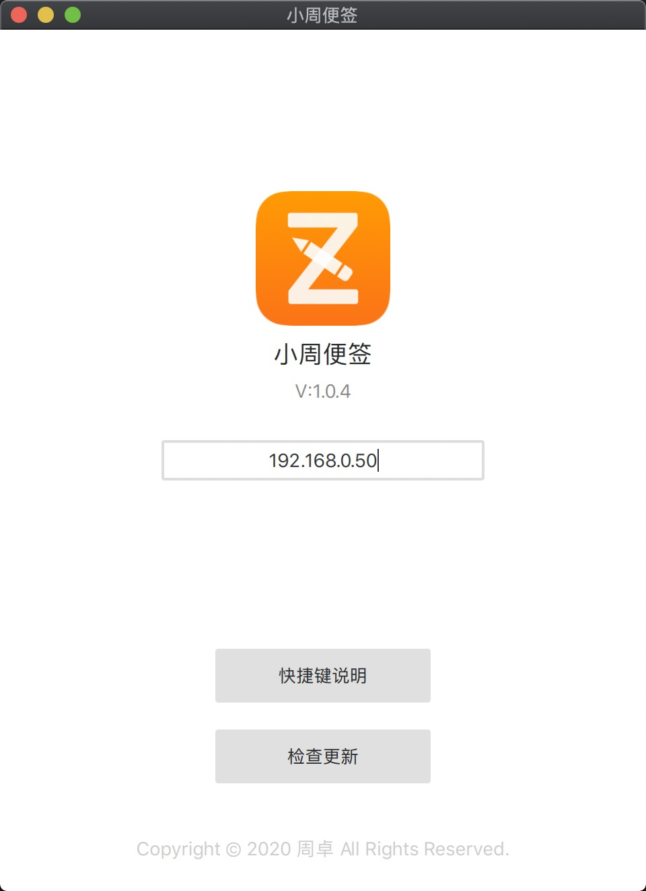
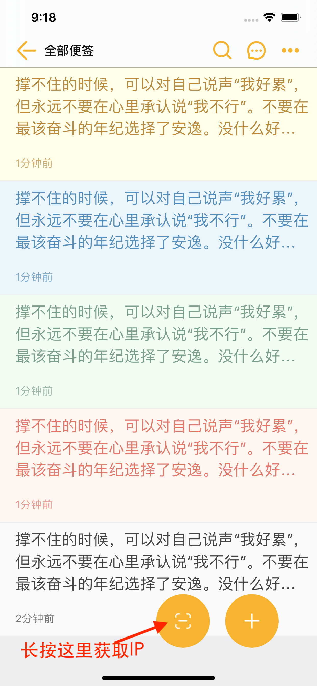

# PC端

## 1. 什么是PC端？

就是电脑端，小周提供了一款功能比较简单的电脑端，用于辅助编辑，相当于手机端的外接键盘，如下图。

## 2. 怎么下载PC端？

[https://www.zznote.top](https://www.zznote.top)

## 3. 怎么使用PC端？

（1）首先，电脑和手机连接同一个局域网WIFI；  
（2）然后手机端长按便签的扫码按钮，获取IP地址；  
（3）电脑端输入这个IP地址；  
（4）然后手机端打开一个纯文本便签；  
（5）就可以使用电脑端实时编辑手机端的便签啦。

、
